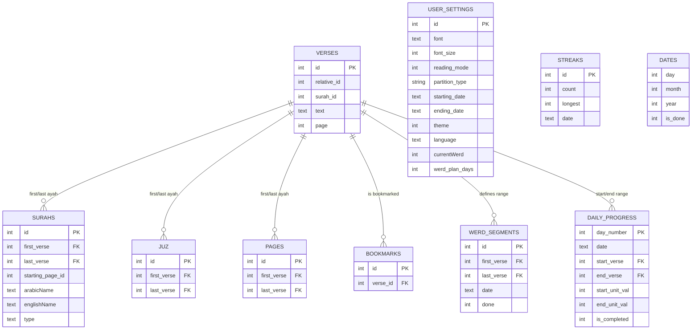

# Werd
A dedicated app for reading the Holy Quran and tracking your Werd with minimal UI and simple features that does not distract the reader and encourages maintaining your reading streak.

## Features
* Creating a detailed plan for werd
* Tracking progress and managing streaks
* Multiple reading modes and custom fonts
* Dual Language Support
* Werd to PDF exporter

## Tech Stack
* React-Native (Expo)
* Node.js
* Typescript
* Tailwind CSS
* SQLite

## Database Schema

## Credits
* [Al Quran Cloud API](https://alquran.cloud/api): for providing full quran text and metadata
